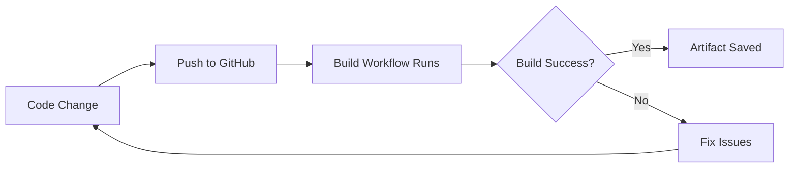

# MCPB GitHub Actions Setup - Complete Package

This package provides everything you need to automate MCPB (MCP Bundle) package building and publishing using GitHub Actions, eliminating the need to commit large (~35MB) package files to your repository.

## 📦 What's Included

### 1. GitHub Actions Workflows

#### `build-mcpb.yml` - Continuous Build Workflow
- **Purpose**: Validates package builds on every push
- **Triggers**: Push to `main`/`develop`, Pull Requests
- **Features**:
  - Validates `manifest.json` syntax
  - Builds MCPB package
  - Verifies package integrity
  - Saves build artifacts (7 days)
  - Generates build summary
- **Location**: `.github/workflows/build-mcpb.yml`

#### `publish-mcpb.yml` - Release Publishing Workflow
- **Purpose**: Automatically publishes to GitHub Releases
- **Triggers**: Version tags (`v1.0.0`, `v2.1.3`, etc.) or manual dispatch
- **Features**:
  - Builds MCPB package
  - Extracts version from tag
  - Generates comprehensive release notes
  - Creates GitHub Release
  - Attaches `.mcpb` file to release
  - Archives artifact (30 days)
- **Location**: `.github/workflows/publish-mcpb.yml`

### 2. Local Testing Script

#### `test-build.sh` - Pre-Push Validation Script
- **Purpose**: Test MCPB builds locally before pushing
- **Features**:
  - Checks all prerequisites (Node.js, npm, jq, mcpb)
  - Validates `manifest.json`
  - Installs dependencies
  - Builds MCPB package
  - Verifies package integrity
  - Lists package contents
  - Checks for common issues
  - Provides detailed build summary
- **Usage**: `./test-build.sh`

### 3. Documentation Files

#### `MCPB_PUBLISHING.md` - Comprehensive Guide
- Complete workflow documentation
- Publishing instructions
- Troubleshooting guide
- Best practices
- Versioning strategy

#### `SETUP_GUIDE.md` - Quick Start Guide
- Step-by-step installation instructions
- Workflow explanations
- Customization options
- Success indicators

### 4. Configuration Template

#### `.mcpbignore` - Package Size Optimization
- Template for excluding unnecessary files
- Reduces package size
- Similar to `.npmignore` or `.gitignore`

## 🚀 Quick Start

### Step 1: Copy Files to Your Repository

```bash
# Create workflows directory
mkdir -p .github/workflows

# Copy workflow files
cp build-mcpb.yml .github/workflows/
cp publish-mcpb.yml .github/workflows/

# Copy test script
cp test-build.sh ./
chmod +x test-build.sh

# Copy documentation
mkdir -p docs
cp MCPB_PUBLISHING.md docs/
cp SETUP_GUIDE.md docs/

# Copy .mcpbignore (optional but recommended)
cp .mcpbignore ./
```

### Step 2: Commit and Push

```bash
git add .github/workflows/*.yml test-build.sh docs/*.md .mcpbignore
git commit -m "Add MCPB automation workflows"
git push origin main
```

### Step 3: Verify

1. Go to GitHub Actions tab
2. You should see "Build MCPB Package" workflow running
3. Check that it completes successfully

### Step 4: Create Your First Release

```bash
# Test locally first
./test-build.sh

# Create and push version tag
git tag v1.0.0
git push origin v1.0.0

# Watch the publish workflow in Actions tab
# Your release will appear in the Releases section
```

## 🎯 How It Works

### Development Flow



### Release Flow


## 🔍 Key Features

### ✅ No Large Files in Repository
- `.mcpb` files (35MB+) are never committed
- Only source code and configuration in Git
- Releases stored separately in GitHub Releases

### ✅ Automated Validation
- Every push triggers build validation
- Catch issues before they reach production
- Build artifacts available for testing

### ✅ One-Click Publishing
- Tag a version → automatic release
- Consistent release notes
- Professional GitHub Releases

### ✅ Local Testing
- Test builds before pushing
- Validate changes immediately
- Catch issues early

### ✅ Customizable
- Easy to modify workflows
- Configurable retention periods
- Extensible with additional steps

## 📊 Workflow Comparison

| Feature | Build Workflow | Publish Workflow |
|---------|---------------|------------------|
| **Trigger** | Every push, PRs | Version tags |
| **Purpose** | Validation | Distribution |
| **Artifact Retention** | 7 days | 30 days + Release |
| **Creates Release** | No | Yes |
| **Public Availability** | Team only | Public download |

## 🛠️ Configuration Options

### Customize Build Triggers

Edit `build-mcpb.yml`:

```yaml
on:
  push:
    branches:
      - main
      - develop
      - feature/*  # Add branches
```

### Customize Release Notes

Edit `publish-mcpb.yml` step "Generate release notes" to customize the release description.

### Add Build Steps

Both workflows support additional steps:

```yaml
- name: Run tests
  run: npm test

- name: Lint code  
  run: npm run lint

- name: Security audit
  run: npm audit
```

## 🎓 Best Practices

1. **Test Locally First**
   ```bash
   ./test-build.sh
   ```

2. **Use Semantic Versioning**
   ```bash
   # Patch: bug fixes (1.0.0 → 1.0.1)
   npm version patch
   
   # Minor: new features (1.0.1 → 1.1.0)
   npm version minor
   
   # Major: breaking changes (1.1.0 → 2.0.0)
   npm version major
   ```

3. **Keep Package Size Small**
   - Use `.mcpbignore` to exclude unnecessary files
   - Install only production dependencies
   - Remove dev dependencies before building

4. **Monitor Workflows**
   - Check Actions tab after each push
   - Review workflow logs for warnings
   - Monitor artifact storage usage

5. **Update Documentation**
   - Keep release notes current
   - Update CHANGELOG.md
   - Document breaking changes

## 🐛 Common Issues & Solutions

### Issue: "No .mcpb file found"
**Solution**: 
```bash
# Verify manifest.json exists and is valid
jq empty manifest.json

# Test build locally
./test-build.sh
```

### Issue: Tag doesn't trigger publish
**Solution**:
```bash
# Verify tag format (must be v*.*.*)
git tag v1.0.0  # ✅ Correct
git tag 1.0.0   # ❌ Wrong

# Push the tag
git push origin v1.0.0
```

### Issue: Package too large
**Solution**:
1. Review `.mcpbignore` file
2. Remove dev dependencies: `npm prune --production`
3. Check for large assets
4. Consider external asset hosting

### Issue: Workflow file not recognized
**Solution**:
- File must be in `.github/workflows/`
- File extension must be `.yml`
- Check YAML syntax validity

## 📚 Additional Resources

- [MCPB Specification](https://github.com/anthropics/mcpb/blob/main/README.md)
- [Manifest Documentation](https://github.com/anthropics/mcpb/blob/main/MANIFEST.md)
- [GitHub Actions Docs](https://docs.github.com/en/actions)
- [Semantic Versioning](https://semver.org/)

## 📞 Support

For your F5 Cloud Status MCP project:
- **Repository**: https://github.com/robinmordasiewicz/f5cloudstatus-mcp
- **NPM Package**: https://www.npmjs.com/package/f5cloudstatus-mcp
- **Issues**: [GitHub Issues](https://github.com/robinmordasiewicz/f5cloudstatus-mcp/issues)

For MCPB questions:
- **MCPB Repository**: https://github.com/anthropics/mcpb
- **MCPB Issues**: https://github.com/anthropics/mcpb/issues

## ✨ Success Checklist

After setup, verify:

- [ ] Workflow files in `.github/workflows/`
- [ ] Test script is executable (`chmod +x test-build.sh`)
- [ ] Build workflow runs on push
- [ ] Build completes successfully
- [ ] Artifacts appear in Actions → workflow run
- [ ] Version tag creates GitHub Release
- [ ] `.mcpb` file attached to release
- [ ] Users can download and install package

## 🎉 What's Next?

1. **Test Everything**
   ```bash
   ./test-build.sh
   ```

2. **Commit the Setup**
   ```bash
   git add .github/workflows/*.yml test-build.sh
   git commit -m "Add MCPB automation"
   git push
   ```

3. **Create Your First Release**
   ```bash
   git tag v1.0.0
   git push origin v1.0.0
   ```

4. **Share Your Package**
   - Point users to GitHub Releases
   - Update README with installation instructions
   - Add download badge to README

## 🏆 Benefits Summary

| Before | After |
|--------|-------|
| Manual `mcpb pack` | Automatic builds |
| 35MB files in Git | Clean repository |
| Manual uploads | One-click releases |
| No validation | Continuous validation |
| Inconsistent releases | Professional releases |
| Error-prone | Automated & reliable |

---

**Made for**: F5 Cloud Status MCP Server
**Author**: Robin Mordasiewicz (Sales Engineer, F5 - Financial Services)
**Purpose**: Automated MCPB packaging for F5 Distributed Cloud (XC) demonstrations

*This automation package ensures your F5 Cloud Status MCP server is always build-ready and professionally distributed for your financial services customer demonstrations and proof of concepts.*
